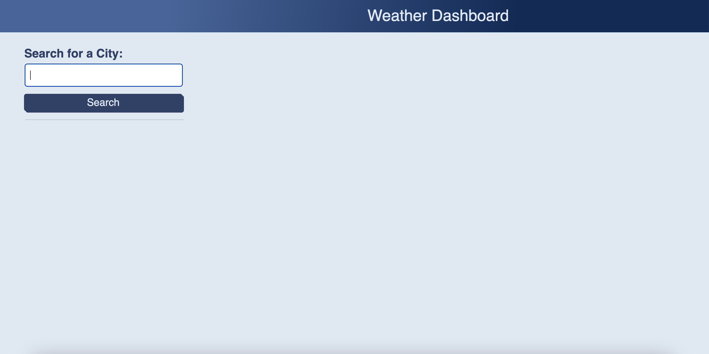
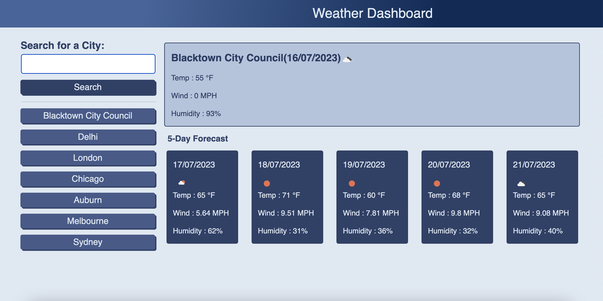
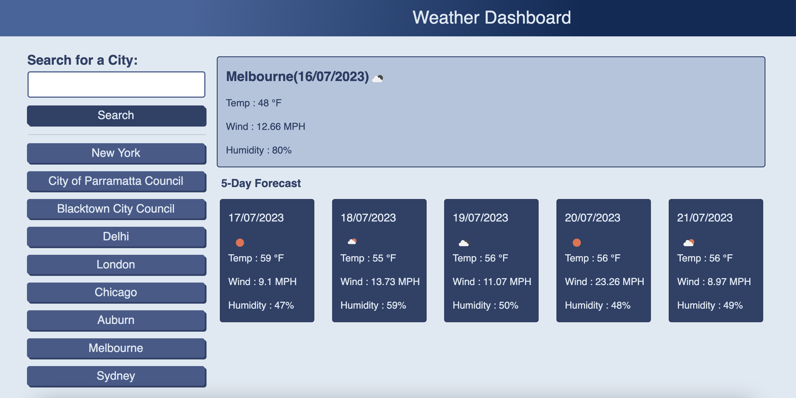

# Five Day Weather Radar Webpage

## Description

This application builds a webpage that enables the user to search for weather outlook by cities. The user can see current and future weather conditions for a searched city including city name, date, an icon representation of the weather condition, temperature, wind and humidity. This application also keeps track of the recent search history. The user can view the current and future weather conditions of a searched city again by clicking on its name from the recent search history .

## Installation

N/A

## Usage

The user is presented with a search bar at the top left of the page when the application is opened. The user can search for the current and future weather conditions of a city  by providing its name. Up on clicking the search button after entering the city name the user is presented with the current weather data which includes city name , date, icon representation of the  weather condition, temperature, wind and humidity at the top right of the page which is then followed by the future weather data which contains data for the next 5 days including date, icon representation of the weather condition, temperature, wind and humidity. The searched city name will be stored in to the search history which is shown at the left side of the page below the search bar. The user can view the weather outlook of a city again by clicking on the city name from search history if it is already stored. The search history shows the recently searched 10 cities with the most recently searched city on the top.

Link to website :

https://shimna-puthanayil.github.io/five-day-weather-radar/

The following images show the web application's appearance and functionality :

## Credits

References

https://developer.mozilla.org/en-US/docs/Web/JavaScript/Reference/Global_Objects/Math/max

https://developer.mozilla.org/en-US/docs/Web/JavaScript/Reference/Global_Objects/Array/splice

https://www.w3schools.com/jsref/jsref_indexof_array.asp

https://day.js.org/docs/en/display/unix-timestamp

## License

MIT license.
